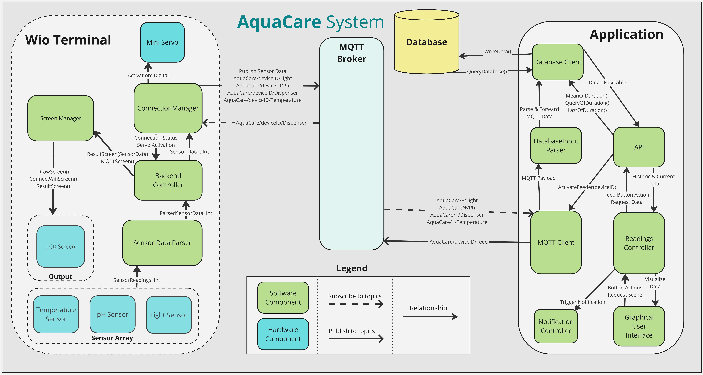

# **AquaCare**

[[_TOC_]]

## **Description**

AquaCare offers an aquarium monitoring system designed to assist in maintaining fish and plant life in a well-nurtured environment. The system collects readings using pH and temperature sensors to provide users with detailed historical and realtime data on temperature, pH and light levels.

AquaCare offers products tailored to owners with specific needs, including species highly sensitive to temperature and pH fluctuations. Additionally, it provides a solution for anyone who wants to be notified of an excessive levels which can be harmful to aquatic life.

To save time and ensure proper care, AquaCare notifies users when monitored levels (such as temperature or pH) exceed set thresholds, indicating the need for adjustments to protect aquatic life from hazardous conditions. AquaCare also includes an food dispenser for customers who prefers to feed their fish remotely.

AquaCare's historical data can be used to offer potential buyers detailed insights into how fish and plants have been cared for, displaying their habitat conditions during ownership.

Our application serves as a central hub for aquarium monitoring, offering real-time sensor readings and a comprehensive overview of the health and conditions of aquatic life.

<!--- 
## Visuals
Depending on what you are making, it can be a good idea to include screenshots or even a video (you'll frequently see GIFs rather than actual videos). Tools like ttygif can help, but check out Asciinema for a more sophisticated method.
-->

## **How To Set Up**

### **Application**

#### **Prerequisites**
Before installing the application, ensure you have the following prerequisites installed on your system:

- Java Development Kit (JDK) version 19 or higher: [Download JDK](https://www.oracle.com/java/technologies/downloads/#java19)

#### **Downloading the source code**

To download the source code, check [Relases](https://git.chalmers.se/courses/dit113/2024/group-16/dev-team-16/-/releases) tab. There, under the assets menu, you can find and download the most recent source code release. 

After downloading the .zip file, extract the contents using [7zip](https://www.7-zip.org/)

#### **Building and Running the Application**

Within the extracted project folders, locate and enter **AquaCare** which is the folder that holds **Application** related files. 

Open a CLI tool which could be **Command Prompt** or **PowerShell** in Windows and navigate to the **AquaCare** folder. Check this [Guide](https://www.codecademy.com/learn/learn-the-command-line/modules/learn-the-command-line-navigation/cheatsheet) for more information about navigating the file system using a CLI. 
- If using **Command Prompt**, use `gradlew` command 
- If using **PowerShell**, use `./gradlew` command
- For **Linux** and **Mac** CLI tools, you should use `./gradlew` like the **PowerShell** users

To automatically build the application, try running **build** task along with **gradlew** command such as: `gradlew build`
  
- You can then locate **build** folder which just appeared after building the project. In **build\distributions**, there should be two compressed packages. Extract the zip file and locate **bin** folder which has runnable files. Which one to run depends on the Operating System on the users computer.

To automatically build and run the application, try running **run** task along with **gradlew** command such as: `gradlew run`

### **Wio Terminal**

#### **Dependencies**

1. [Wio Terminal](https://wiki.seeedstudio.com/Wio-Terminal-Getting-Started/)

2. [Arduino IDE](https://www.arduino.cc/en/software) or [Arduino CLI](https://arduino.github.io/arduino-cli/0.35/installation/) (We recommend using IDE since it is more user friendly)

3. Source code of the project packaged as a zip in [Relases](https://git.chalmers.se/courses/dit113/2024/group-16/dev-team-16/-/releases) tab.

4. [Wio Terminal Board Library](https://wiki.seeedstudio.com/Wio-Terminal-Getting-Started/#software)

5. Required Libraries:

    1. [PubSubClient@2.8](https://www.arduino.cc/reference/en/libraries/pubsubclient/)
    2. [Seeed Arduino rpcUnified@2.1.4](https://www.arduino.cc/reference/en/libraries/seeed-arduino-rpcunified/)
    3. [Seeed Arduino rpcWiFi@1.0.7](https://www.arduino.cc/reference/en/libraries/seeed-arduino-rpcwifi/)
    4. [Seeed Arduino SFUD@2.0.2](https://www.arduino.cc/reference/en/libraries/seeed-arduino-sfud/)
    5. [Seeed_Arduino_mbedtls@3.0.1](https://www.arduino.cc/reference/en/libraries/seeed_arduino_mbedtls/)
    6. [ArduinoSTL](https://www.arduino.cc/reference/en/libraries/arduinostl/)
    7. [WiFiNINA](https://www.arduino.cc/reference/en/libraries/wifinina/)
    8. [Seeed Arduino rpcBLE@1.0.0](https://www.arduino.cc/reference/en/libraries/seeed-arduino-rpcble/)
    9. [Master-Servo](https://github.com/PaintYourDragon/Servo)
6. Sensors Used In Our Project (Exact same product may not be required):

    1. [Temperature sensor](https://wiki.seeedstudio.com/Grove-Temperature_Sensor_V1.2/)
    2. [Garsent Digital pH Sensor](https://www.amazon.se/-/en/Garsent-Digital-Composite-ElectrodeAquaculture/dp/B07QKK1XB6) 
    3. [Grove Light Sensor](https://wiki.seeedstudio.com/Grove-Light_Sensor/)
    4. [MMOBIEL Servo Motor](https://www.amazon.se/-/en/Micro-Servo-Motor-Kit-Radio-Controlled/dp/B097RD8RB7/?th=1)

#### **Installation Process**
1. Install and open **Arduino IDE**. You can use the link in [Dependencies](https://git.chalmers.se/courses/dit113/2024/group-16/dev-team-16#dependencies) to navigate to Arduino offical website.

2. Download source code from [Relases](https://git.chalmers.se/courses/dit113/2024/group-16/dev-team-16/-/releases) tab. Unzip the package using [7zip](https://www.7-zip.org/).

3. Locate and open **WioTerminal.ino** file using the IDE. The file should be located within **WioTerminal** directory.

4. In your Arduino IDE, click on **File > Preferences**, and copy the [url](https://files.seeedstudio.com/arduino/package_seeeduino_boards_index.json) to **Additional Boards Manager URLs**.

5. Click on **Tools > Board > Board Manager** and Search **Wio Terminal** in the **Boards Manager** and install it.

6. You'll need to select the entry in the **Tools > Board** menu that corresponds to your Arduino. Select the **Wio Terminal**.

7. Now we we have to install the required libraries. Open **Library Manager** in **Arduino IDE**. From required libraries section of [Dependencies](https://git.chalmers.se/courses/dit113/2024/group-16/dev-team-16#dependencies), search for each library in **Library Manager** and download. All of them are required for Installation to be complete.

8. Some libraries may not be in Arduino Library Manager, those libraries need to be downloaded and then imported as .zip files. To download the library, click on the library to visit the code hosting website, then download the .zip file by **Code > Download ZIP**. To import a .zip library, **Sketch > Include Library > Add .ZIP Library** and select the previously downloaded file.

9. After every single library has been installed, press on **Verify** on the top left corner of the IDE. If there is a problem, it is probably due to a library issue which you may have to double check. If the compilation works with no problems, you are ready to install the script into the device by pressing **Upload** button.

### **For Developers**
If you're a developer looking to contribute, we encourage you to fork the repository using  button and download the `main` branch from the newly created remote private repository. 

While releases provide stable versions of the software, the `main` branch will always have the most recent changes and updates. This allows you to work with the latest code, making it easier to implement new features or fix bugs. 

Please follow the contribution guidelines detailed in the [`contributions.md`](https://git.chalmers.se/courses/dit113/2024/group-16/dev-team-16/-/blob/main/CONTRIBUTING.md) file when submitting your changes.

### **Further Customize Your System**

Some of these customizations may be required for your system to function therefore we recommend going over them.

**Wio Terminal**

We store Wifi credentials in code therefore Terminal may have problems connecting to your local network. We will have to change wifi SSID and password in the [**WiFI.cpp**](WioTerminal/WiFI.cpp#4) file which is located in WioTerminal directory.

To make edits on the code, you could use any type of text editor such as Windows Notepad, Visual Studio Code, Apple TextEdit or Sublime Text.

The changes should be made on 4th and 5th lines of the file which specifies a SSID and a password. Changes should be made within the quotation marks ("") and the modified text must precisely match the WiFi SSID and password, including capitalization and without any extra spaces or alterations.

After the changes, the file needs to be saved. Use `Ctrl + S` shortcut or try **File >  Save** menu on top-bar. See [Wio Terminal Installation Process](https://git.chalmers.se/courses/dit113/2024/group-16/dev-team-16#installation-process)

**Database**

Our application stores API keys and other database-related information directly in the code, therefore we recommend users to create a new database so they can have more privacy. 

To set up a new Influx Database for the application, you can follow these steps:

Create an account or log in to [Cloud InfluxDB](https://cloud2.influxdata.com/signup) Once logged in, create an organization and give it a name. 

Next, create a storage bucket and name it `Storage` and generate an API token which will be used for authentication.

After setting up the InfluxDB, open the `InfluxDBJavaClient.java` file in `AquaCare/src/main/ui/utilities` directory using a text editor. Update line **48** and **50** according to your API token and organization name and line **53** according to your InfluxDB address. Ensure that the entered details match exactly with what you have on InfluxDB.

After making these changes, save the file. You can use the `Ctrl + S` shortcut or navigate to the **File > Save** menu on the top-bar. Once saved, build and run the application again.

## **Roadmap**
For a detailed view of expected future releases and upcoming features, please refer to [Milestones](https://git.chalmers.se/courses/dit113/2024/group-16/dev-team-16/-/milestones).

## **System Design**

## **Contributing**

In the [Contributions.md](https://git.chalmers.se/courses/dit113/2024/group-16/dev-team-16/-/blob/main/CONTRIBUTING.md) file, you'll find general guidelines for participating in this project. This includes steps on how to propose changes to the project, how to submit a pull request, and the process for reviewing and merging that request. For more detailed information on each contribution type and specific instructions, please refer to the [contributions.md](https://git.chalmers.se/courses/dit113/2024/group-16/dev-team-16/-/blob/main/CONTRIBUTING.md) file.

## **Authors and Acknowledgment**
- Ahmet Yavuz Kalkan([@ahmety](https://git.chalmers.se/ahmety)): Made substantial contributions to the backend with some contributions to front end parts of the application.

- Süeda Nalan Tahtaci([@sueda](https://git.chalmers.se/sueda)): Made substantial contributions to the front-end with some contributions to backend parts of the application.

"- Ravi Sharma(@ravisha): Led the team as project manager and made substantial contributions to the back end with a specific emphasis on the Wio Terminal."

Special Thanks To

- [Sabina Akbarova](https://git.chalmers.se/akbarov)

- [Francisco Gomes](https://git.chalmers.se/francisco.gomes)

- [Amin Mahmoudifard](https://git.chalmers.se/aminmah)

Special thanks for guidance throughout the project

<!---
## **Support**
[Buy us a coffee](https://www.coop.se/handla/varor/dryck/kaffe/bryggkaffe/bryggkaffe-mellanrost-8711000530085)
-->

## **License**
This project is under MIT license, to read more refer to [License](https://git.chalmers.se/courses/dit113/2024/group-16/dev-team-16/-/blob/main/LICENSE.MD)
